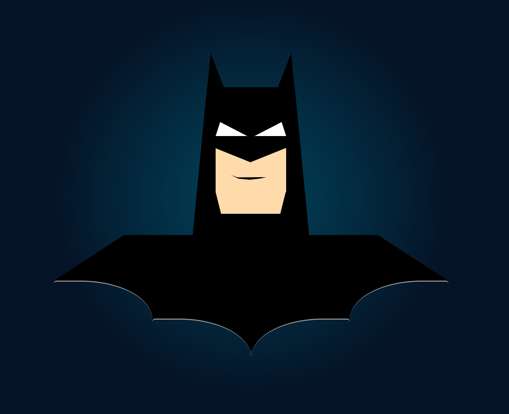

# the-dark-knight-in-css
CSS Art | The Dark Knight | Batman | Pure CSS


## Overview
This project showcases an image of Batman created entirely using pure CSS. No images or external graphics are used; everything is crafted with CSS.


## File Structure
The project is organized as follows:

- `index.html`: The main HTML file that includes the structure of the Batman image.
- `styles/`: This folder contains all the CSS files used to style the Batman image.

### Styles Folder
The `styles` folder is particularly important as it contains a series of CSS files named incrementally (e.g., `01.css`, `02.css`, etc.). Each file represents an incremental change in the development of the CSS image. By following the sequence of these files, you can see the step-by-step progression and refinement of the Batman image. `1.css` contains the initial setup whereas `9.css` is the final code for the whole Batman CSS art. `10.css` has extra outlines around main parts of the image for understanding purpose only.

## Running a Local Development Server

This project uses Vite for building and serving the development environment. Although not required, it also has support for TypeScript.
To run a local development server for this project, you can use either `pnpm` or `npm`. Follow the instructions below:

### Using `npm`

1. Install the project dependencies:
    ```sh
    npm install
    ```

2. Start the development server:
    ```sh
    npm start dev
    ```

### Using `pnpm`

1. Install pnpm if you haven't already:
    ```sh
    npm install -g pnpm
    ```

2. Install the project dependencies:
    ```sh
    pnpm install
    ```

3. Start the development server:
    ```sh
    pnpm dev
    ```

Once the server is running, open your web browser and navigate to `http://localhost:5173` to view the project.

## Authors
* [**Tushar Shukla**](https://github.com/tusharshuklaa)
